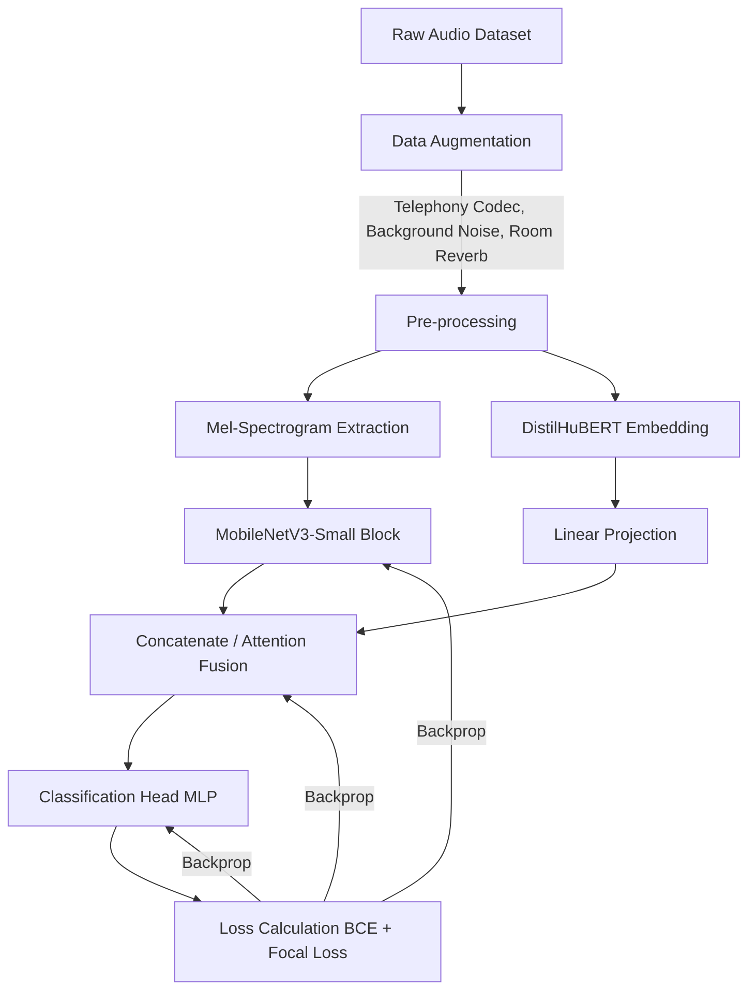

# VoiceGuard: Architecture & Pipeline Design

## 1. 目標数値 (KPIs)
エッジ環境（ローカル）での実行を前提とし、ユーザーのUXを損なわず、かつ誤検知による体験悪化を防ぐための厳格な目標値を設定する。

* **精度指標**
  * **AUC**: `> 0.98` (In-domain), `> 0.94` (Out-of-domain)
  * **FPR (False Positive Rate) = 0.1% 時の TPR**: `> 85%` (誤って人間の声をFakeと判定する確率を0.1%に抑えつつ、85%のFakeを検出)
* **パフォーマンス指標**
  * **モデルサイズ**: `< 15MB` (推論SDK含むパッケージ全体で20MB未満)
  * **推論レイテンシ**: `< 100ms` / 3秒チャンク (Snapdragon 8 Gen 1 / Apple A15 / WASM-SIMD環境下)
  * **メモリフットプリント**: `< 50MB` 実行時ピークメモリ

## 2. 特徴量の設計
モデルの軽量化と汎化性能を両立させるため、2ストリーム（音響的特徴 + 意味的/生成痕跡特徴）のハイブリッドアプローチを採用する。

1. **Mel-Spectrogram (音響的特徴)**
   * サンプリングレート: `16kHz` (電話音声・Web会議のダウンサンプリングに対応)
   * ウィンドウサイズ: `25ms`, ホップサイズ: `10ms`, メルビン数: `80`
   * 入力長: 3秒クリップ -> `(80, 300)` の2Dテンソル
   * *目的*: ボコーダー（HiFi-GAN等）特有の周波数帯域の不自然さ、高周波ノイズの欠落を捉える。
2. **自己教師あり学習埋め込み (Wav2Vec2系)**
   * 事前学習モデル: `DistilHuBERT` または極小化・蒸留済み `WavLM` (パラメータ数 20M以下に剪定・蒸留したものを使用)
   * 特徴量: 最終層の隠れ状態プールベクトル (次元数 `256` または `768`)
   * *目的*: 音響的ノイズ（圧縮劣化等）に依存しない、生成モデル特有の音素間遷移の不自然さを捉える。

## 3. モデルアーキテクチャの選択肢
* **ベースアーキテクチャ**: `MobileNetV3-Small` (Mel-spec処理用) + 軽量Attentionレイヤー (Wav2vec埋め込みとの融合用)
* **構成案**:
  * Mel-spec入力をMobileNetV3で特徴マップ化 (CNN系列)
  * Wav2vec埋め込みをLinear層で次元削減
  * 両特徴量をConcatし、MLPヘッダーで2値分類 (Sigmoid出力: `0.0 = Real`, `1.0 = Fake`)

## 4. 学習パイプライン

## 5. 推論パイプライン
* 連続的な音声ストリームをバッファリングし、`3.0秒`チャンク（ストライド `1.5秒`）ごとにスライディングウィンドウで推論。
* 過去N回の推論結果を移動平均（または単純なVote）し、最終的なスコアを平滑化して急激なフリッカーを防ぐ。

## 6. ONNX変換と量子化戦略
* **ONNXエクスポート**: PyTorch `torch.onnx.export` を使用し、Opset version `15` 以上を指定（モバイル系の互換性担保）。
* **量子化**:
  * **INT8 Dynamic Quantization**: CPU/WASM向けのデフォルト。重みのみINT8化し、アクティベーションは実行時に量子化。
  * **INT8 Static Quantization**: キャリブレーションデータ（実環境のノイズ入り音声1000件）を用いた静的量子化。iOS (NPU) / Android (NNAPI) で最大性能を出すために適用。

## 7. 各プラットフォームでの推論統合方法
1. **Web (Chrome Extension / Browser App)**
   * `onnxruntime-web` を利用。WASM + SIMDを有効化し、利用可能なら `WebGPU` バックエンドへフォールバック。
   * Manifest V3のBackground Service Worker上で推論処理を分離し、UIスレッドをブロックしない。
2. **iOS**
   * CoreMLへ変換 (`coremltools`) し、`Vision` または直接 `CoreML` フレームワークでロード（Neural Engineでの実行）。
   * SwiftによるC-APIラッパー提供。
3. **Android**
   * `onnxruntime-android` (AAR) を組み込み、NNAPI (Neural Networks API) デリゲートを有効化し、ハードウェアアクセラレーションを活用。Kotlin APIとしてラップ。
