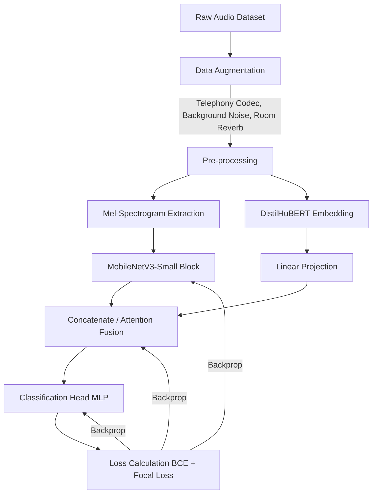

# VoiceGuard — Architecture & Pipeline Design

## 1. Targets (KPIs)
We assume edge (local) execution and we set strict targets so we never hurt UX with false positives.

* **Accuracy**
  * **AUC**: `> 0.98` (in-domain), `> 0.94` (out-of-domain)
  * **TPR at FPR = 0.1%**: `> 85%` (catch 85% of fakes while misclassifying real human voice as fake at most 0.1% of the time)
* **Performance**
  * **Model size**: `< 15 MB` (full inference SDK package < 20 MB)
  * **Inference latency**: `< 100 ms` per 3-second chunk (Snapdragon 8 Gen 1 / Apple A15 / WASM-SIMD)
  * **Memory footprint**: `< 50 MB` peak at runtime

## 2. Feature design
For both compactness and generalization, we use a two-stream hybrid (acoustic + semantic / generation-trace features).

1. **Mel-Spectrogram (acoustic features)**
   * Sample rate: `16 kHz` (matches phone audio and downsampled web meetings)
   * Window size: `25 ms`, hop size: `10 ms`, mel bins: `80`
   * Input length: 3-second clip → `(80, 300)` 2D tensor
   * *Purpose*: capture vocoder (e.g. HiFi-GAN) spectral artifacts and missing high-frequency noise.
2. **Self-supervised embeddings (wav2vec2 family)**
   * Pretrained model: `DistilHuBERT` or a heavily distilled / pruned `WavLM` (≤ 20M parameters)
   * Feature: pooled hidden state from the final layer (`256` or `768` dims)
   * *Purpose*: capture the unnatural phoneme transitions specific to generators, independent of acoustic noise (e.g. compression).

## 3. Model architecture choices
* **Base architecture**: `MobileNetV3-Small` (mel-spec branch) + a lightweight Attention layer (fusion with the wav2vec embedding)
* **Composition**:
  * Mel-spec → MobileNetV3 (CNN feature map)
  * Wav2vec embedding → Linear projection (dimension reduction)
  * Concatenate → MLP head → binary classifier (sigmoid: `0.0 = Real`, `1.0 = Fake`)

## 4. Training pipeline

## 5. Inference pipeline
* Buffer the live audio stream and run inference on `3.0 s` chunks with `1.5 s` stride (sliding window).
* Smooth the output with a moving average (or simple voting) over the last N predictions to suppress flicker.

## 6. ONNX export and quantization strategy
* **ONNX export**: `torch.onnx.export` with opset version `15` or higher (mobile-side compatibility).
* **Quantization**:
  * **INT8 dynamic quantization**: default for CPU / WASM. Weights quantized to INT8; activations quantized at runtime.
  * **INT8 static quantization**: with a calibration set (1,000 clips of real-world noisy audio). Used to extract maximum performance on iOS (NPU) / Android (NNAPI).

## 7. Per-platform inference integration
1. **Web (Chrome Extension / browser app)**
   * Use `onnxruntime-web`. Enable WASM + SIMD; fall back to `WebGPU` when available.
   * Run inference on the MV3 background service worker so the UI thread is never blocked.
2. **iOS**
   * Convert to CoreML (`coremltools`) and load via `Vision` or directly via the `CoreML` framework (Neural Engine execution).
   * Provide a Swift wrapper around the C API.
3. **Android**
   * Bundle `onnxruntime-android` (AAR), enable the NNAPI (Neural Networks API) delegate for hardware acceleration. Wrap it in a Kotlin API.
